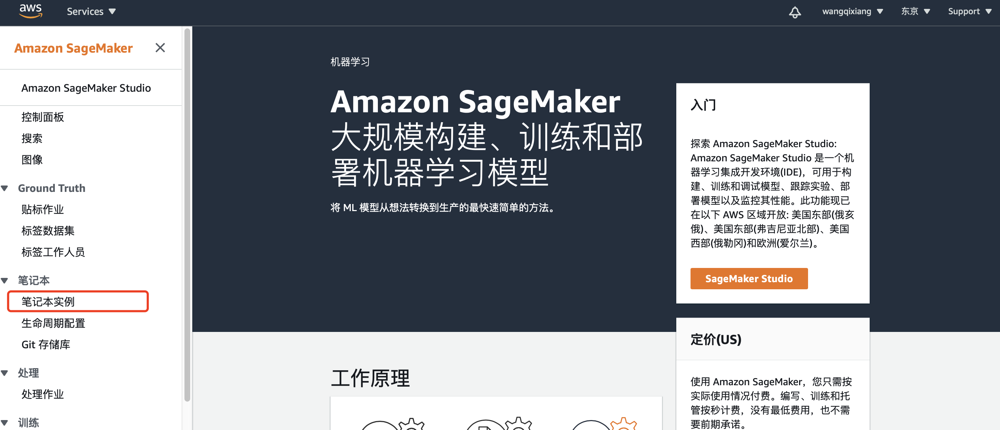
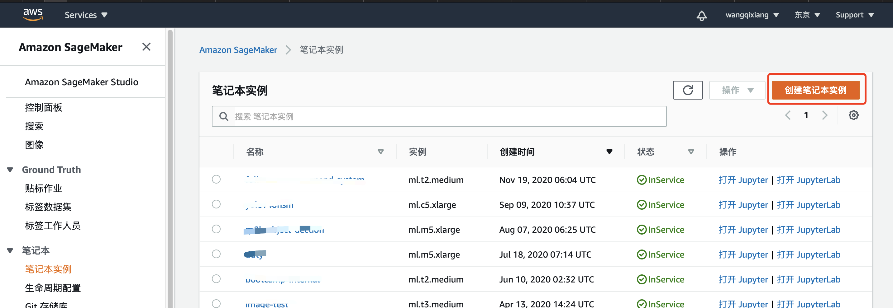
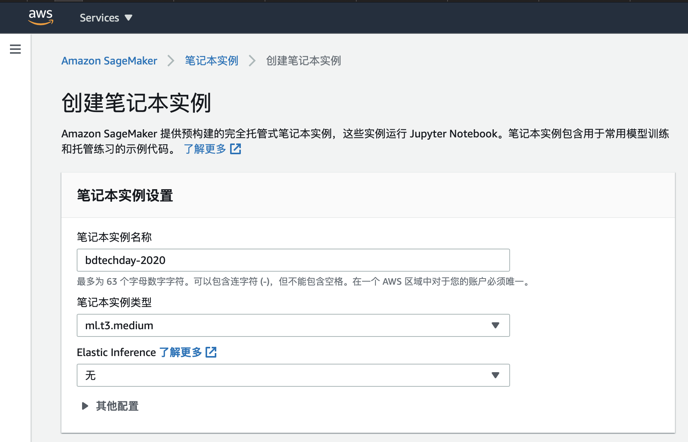
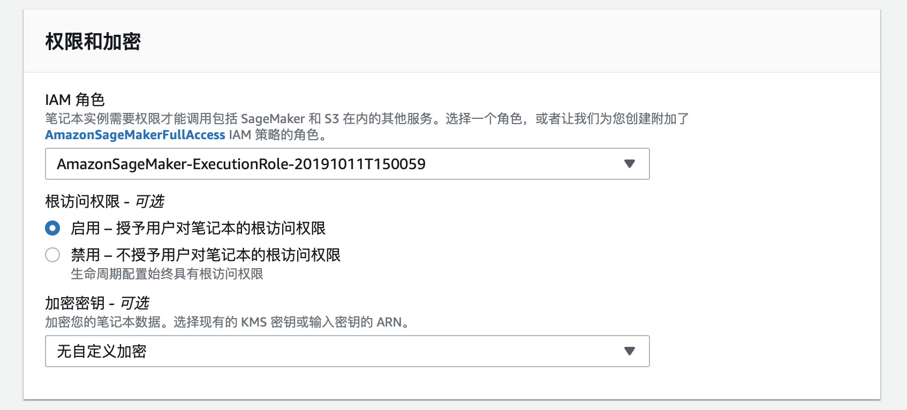
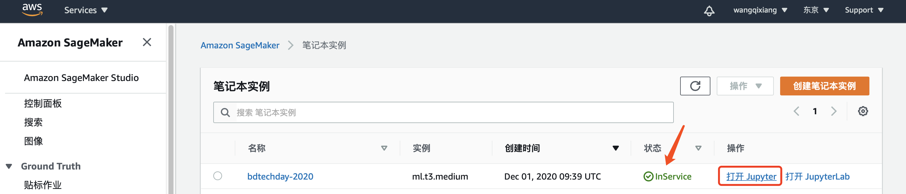
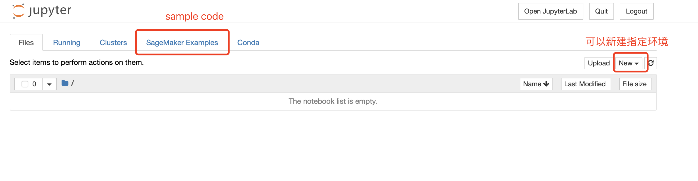
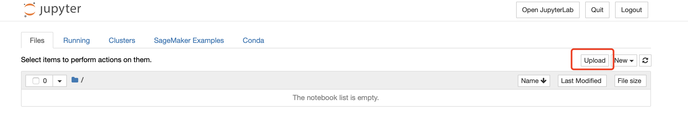

# 2021 AI workshop - object detection

## 实验1：探索 Rekognition 功能

## 实验2：使用 Sagemaker GroundTruth做数据集标注

## 实验3：使用 Sagemaker Notebook 实例训练一个目标检测的模型

### 0-环境准备

1. 创建S3桶
2. 创建IAM role，赋予sagemaker和s3的权限

### 1- 启动Sagemaker笔记本实例

>本次模型训练过程会用的GPU实例，确认账户具有相应的权限

1. 登录到控制台([https://console.aws.amazon.com/](https://console.amazonaws.cn/)) ，切换区域到“ap-northeast-1”，选择SageMaker服务中的笔记本实例

2. 选择创建笔记本实例
  
   
   
   - ` 笔记本实例名称 `：自定义名称
   
- ` 笔记本实例类型 `：根据需要可选”ml.t3.medium“;
  
   
   
   - ` 权限和加密-IAM角色 `：按默认”创建 IAM 角色“,
   
   
   
   - 其余选项可以保持默认
   - 最后点击 `创建笔记本实例 `
   
   
   
3. 打开Sagemaker笔记本实例
    1. 需要该笔记本实例状态变成绿色` InService` 的可用状态

    

    2. 打开Sagemaker笔记本实例之后如下图所示：

    

4. 上传本次实验的sample code到Sagemaker笔记本实例
    1. 下载链接🔗[object_detection_demo.ipynb](https://s3-ap-northeast-1.amazonaws.com/www.qi-xiang.wang/bd-tech-day/CarsClassifier-SageMakerPythonSDK.ipynb)
    2. 先下载上述文件到本地，然后点击Sagemaker笔记本实例的` upload` ，选择保存文件的位置以及文件完成上传
    
    

5. 打开本次实验的jupyter notebook

6. 在本次实验的jupyter notebook中依次执行每一个代码块

***
## 附录：相关资料整理

#### 基础：

* SageMaker 官方文档 :  https://docs.aws.amazon.com/zh_cn/sagemaker/latest/dg/whatis.html 
* AWS 机器学习平台 Amazon SageMaker 详解[视频] : http://aws.amazon.bokecc.com/news/show-2442.html

#### Groudtruth 做数据标记：

* 11使用Amazon SageMaker打造准确的数据标记集[视频] : http://aws.amazon.bokecc.com/news/show-2461.html
* Ground Truth 官方文档： https://docs.aws.amazon.com/zh_cn/sagemaker/latest/dg/sms.html 

#### 使用sagemaker notebook：

* 1-使用Amazon SageMaker托管的Jupyter Notebook实例[视频] : http://aws.amazon.bokecc.com/news/show-2464.html 
* 4使用Amazon SageMaker 训练模型[视频] : http://aws.amazon.bokecc.com/news/show-2468.html
* 开始使用 Amazon SageMaker 笔记本实例官方文档 :  https://docs.aws.amazon.com/zh_cn/sagemaker/latest/dg/gs-console.html 

#### 超参优化：

* 超参数概念介绍：https://www.jianshu.com/p/6602c76cc801
* 6使用Amazon SageMaker超参自动调优[视频] :：http://aws.amazon.bokecc.com/news/show-2469.html
* 超参数自动优化官方文档：https://docs.aws.amazon.com/zh_cn/sagemaker/latest/dg/automatic-model-tuning.html