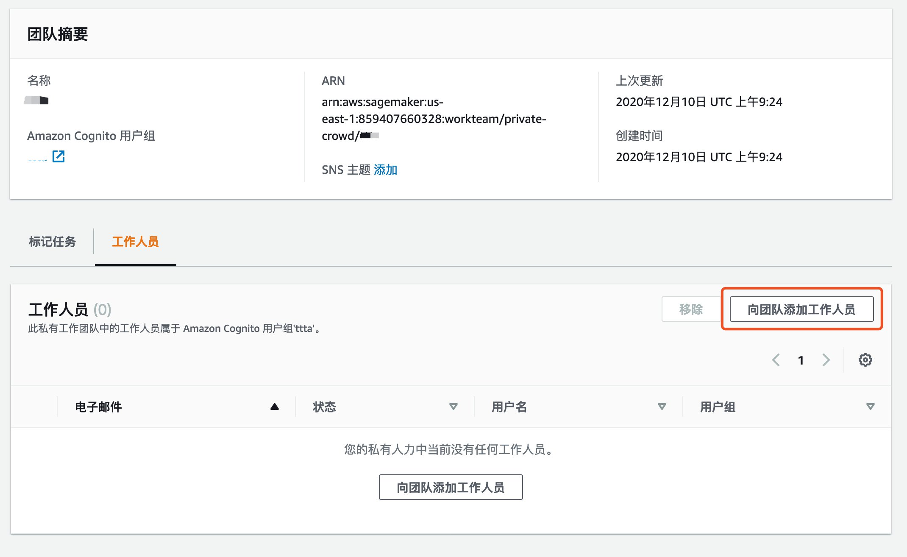

# 2021 AI workshop - object detection

## 实验1：探索 Rekognition custom label 功能

### 0-环境准备

1. 下载‘aidaycvdatasets.zip’，本实验中选取其中的‘rek-dataset’作为训练数据。

### 1-实验步骤

1. 创建自定义标签项目。点击‘创建项目’。填写项目名称，并创建项目。

2. 设置数据集：创建数据集，数据集名称叫“sfparcels”,选择‘从您的计算机上传图像’来上传8张训练数据图像。

3. 添加标签，只需添加一种标签‘sfparcel’。

4. 点击‘Draw bounding box’进入图像标注模式。在每一个样本上标注出顺丰快递的边界框。整体标注完成后，需要点击‘Save Changes’保存标注结果。

5. 点击‘训练模型’，进入训练模型界面，选择之前创建的项目，并选择已标注的数据集。同时选择‘拆分训练数据集’，选择默认的测试集合占20%。

6. 等待模型训练结果。

## 实验2：使用 Sagemaker GroundTruth做数据集标注

### 0-环境准备

1. 下载‘aidaycvdatasets.zip’，本实验中选取其中的‘groundtruth-dataset’作为训练数据。

### 1-创建团队

1. 在sagemaker控制台点击“标签工作人员”进入创建团队界面。

 

2. 点击“私有” 进入私有团队界面。

a.   在私有团队部分 点击“创建私有团队”

 

b. 输入“团队名称” ，其他选项保持默认，点击“创建私有团队”

3. 在工作人员部分 点击“邀请工作人员“

 

 

 

 

a.   输入新工作人员的邮件地址，点击“邀请新工作人员”

 

b. 系统将向新工作人员邮箱发送邀请邮件，请新工作人员打开链接，更改密码，进入工作界面。

 

4. 在私有团队界面，点击新创建的团队，进入团队详情界面后，点击“向团队添加工作人员”

 

a.   点击要添加的组员到团队中。

### 2-创建任务

1. 下载‘aidaycvdatasets.zip’，并使用其中的‘groundtruth-dataset’作为训练数据使用。

2. 拆分文件夹，将jpg文件上传图像文件到所在区域的s3 bucket。上传文件到组长账号的存储桶内的指定路径中。

 

3. 使用拥有admin权限的账户进行标记任务的创建，检查小组长的user是否为admin权限

 

4. 创建标记作业

a.   在左侧导航栏中，选择 **Labeling jobs (**贴标作业)。 

b.   选择 **Create labeling job (**创建标记作业) 以开始作业创建过程。 

c.   在 **Job overview (**作业概览) 部分中，提供以下信息： 

d.   **Job name (**作业名称) – 为标记作业提供一个描述此作业的名称。此名称将显示在作业列表中。该名称在您的账户和 AWS 区域中都必须是唯一的。 

​                        i.   **输入数据设置** – 选择**“**自动数据设置”。 

​                       ii.   **Input dataset location (**输入数据集位置) – 输入您在步骤 1 中创建的清单文件的 S3 位置。 

​                      iii.    **输出数据集位置** – 输出数据将写入到的位置。 

​                      iv.   **IAM** **角色** – 选择“创建新角色”，输入输入数据的s3桶的名称，创建只允许访问特定s3桶的角色。

 

 

 

e. 在**任务类型**部分，对于 **Dataset type (数据集类型)** 字段，选择 **边界框** 作为任务类型。 

f. 选择 **Next (**下一步)继续配置您的标记作业。 

 

g. 团队类型选择“**私有**”。

h. 在“**团队名称**”输入上一步创建的团队名称。

 

 

i. 在上方文本框输入对此次标记的概述，例如“please draw the bounding boxes with correct labels.”

j. 在右侧输入包装的种类，如“bottled”“canned”等，点击添加标签可以添加新标签。可以点击预览进行标记界面的预览。
 k. 点击“创建”完成任务创建。

 

l. 等待几分钟后，工作人员可以登陆到标签工作界面进行打标签工作。

点击相应任务后，点击start working

m. 来到标记界面，点击右侧相应的图像label 选择相应的种类，点击右下角的submit。

## 实验3：使用 Sagemaker Notebook 实例训练一个目标检测的模型

### 0-环境准备

1. 创建S3桶
2. 创建IAM role，赋予sagemaker和s3的权限

### 1- 启动Sagemaker笔记本实例

>本次模型训练过程会用的GPU实例，确认账户具有相应的权限

1. 登录到控制台([https://console.aws.amazon.com/](https://console.amazonaws.cn/)) ，切换区域到“ap-northeast-1”，选择SageMaker服务中的笔记本实例

2. 选择创建笔记本实例
  
   
   
   - ` 笔记本实例名称 `：自定义名称
   
- ` 笔记本实例类型 `：根据需要可选”ml.t3.medium“;
  
   
   
   - ` 权限和加密-IAM角色 `：按默认”创建 IAM 角色“,
   
   
   
   - 其余选项可以保持默认
   - 最后点击 `创建笔记本实例 `
   
   
   
3. 打开Sagemaker笔记本实例
    1. 需要该笔记本实例状态变成绿色` InService` 的可用状态

    

    2. 打开Sagemaker笔记本实例之后如下图所示：

    

4. 上传本次实验的sample code到Sagemaker笔记本实例
    1. 下载链接🔗[object_detection_demo.ipynb](https://staticweb-test-wqx.s3.amazonaws.com/sharefile/object_detection_demo.ipynb)
    2. 先下载上述文件到本地，然后点击Sagemaker笔记本实例的` upload` ，选择保存文件的位置以及文件完成上传
    
    

5. 打开本次实验的jupyter notebook

6. 在本次实验的jupyter notebook中依次执行每一个代码块

***
## 附录：相关资料整理

#### 基础：

* SageMaker 官方文档 :  https://docs.aws.amazon.com/zh_cn/sagemaker/latest/dg/whatis.html 
* AWS 机器学习平台 Amazon SageMaker 详解[视频] : http://aws.amazon.bokecc.com/news/show-2442.html

#### Groudtruth 做数据标记：

* 11使用Amazon SageMaker打造准确的数据标记集[视频] : http://aws.amazon.bokecc.com/news/show-2461.html
* Ground Truth 官方文档： https://docs.aws.amazon.com/zh_cn/sagemaker/latest/dg/sms.html 

#### 使用sagemaker notebook：

* 1-使用Amazon SageMaker托管的Jupyter Notebook实例[视频] : http://aws.amazon.bokecc.com/news/show-2464.html 
* 4使用Amazon SageMaker 训练模型[视频] : http://aws.amazon.bokecc.com/news/show-2468.html
* 开始使用 Amazon SageMaker 笔记本实例官方文档 :  https://docs.aws.amazon.com/zh_cn/sagemaker/latest/dg/gs-console.html 

#### 超参优化：

* 超参数概念介绍：https://www.jianshu.com/p/6602c76cc801
* 6使用Amazon SageMaker超参自动调优[视频] :：http://aws.amazon.bokecc.com/news/show-2469.html
* 超参数自动优化官方文档：https://docs.aws.amazon.com/zh_cn/sagemaker/latest/dg/automatic-model-tuning.html