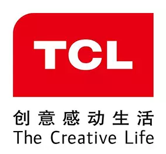

# **TCL AWS AI ** 动手训练营

嗨，您好！欢迎来到TCL同学来到 AWS AI 动手训练营

## 课程介绍

| 时间          | 培训类型            |             课题              | 备注 |
| ------------- | ------------------- | :---------------------------: | ---- |
| 9:00-9:30     | NA                  | 签到 & 实验准备& 领取临时帐号 |      |
| 9:45-10:00    | NA                  |             开场              |      |
| 10:00 - 10:50 | Presentation        |        AWS AI 服务介绍        |      |
| 11:10 - 12:00 | Presentation        |    AWS sagemaker 使用技巧     |      |
| 12:00-13:00   | NA                  |             午饭              |      |
| 13：30-15：30 | Presentation + 动手 |        动手：物品检测         |      |
| 15:30-15:45   | NA                  |            下午茶             |      |
| 15:45- 17:45  | Presentation + 动手 |      动手：推荐模型训练       |      |
| 17:45- 18:00  | NA                  |              Q&A              |      |

## 训练营目标

## 目标受众

热爱AI的TCL 小伙伴们，只要有python基础的都到碗里来吧～～！，AWS AI只要愿意都能会。

## 入群二维码

### 

